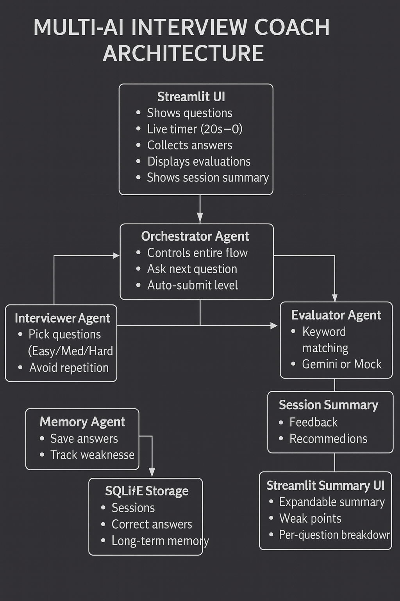
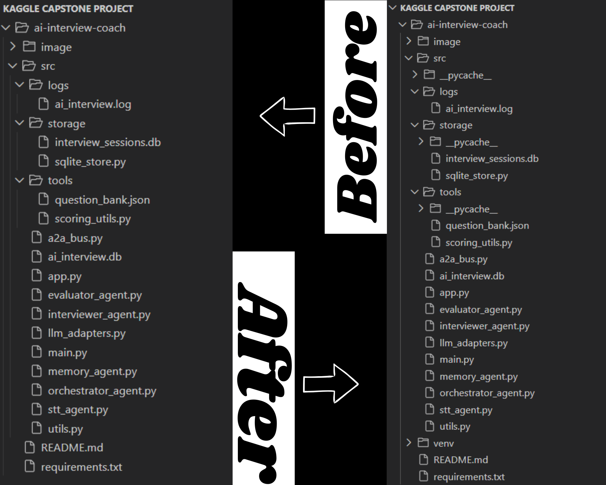
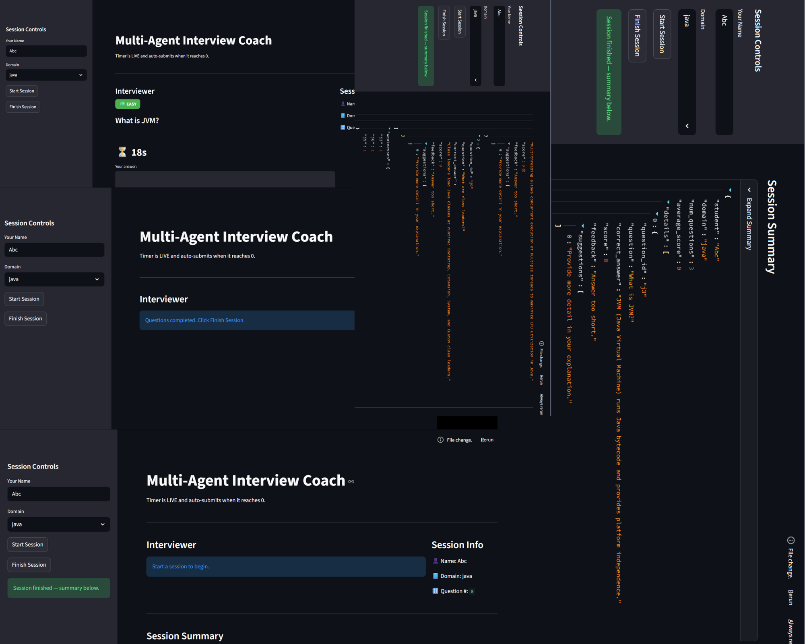

<h1 align="center">📘<b><i> Multi Ai Interview Coach Agent </i></b></h1>

<h4>A fully adaptive Multi-Agent Interview Preparation System built using a modular agent architecture inspired by Google ADK. It automatically conducts interviews, evaluates answers, tracks user weaknesses, and generates a complete session summary.</h4>

<h2 align="left">🧠 <b><i>Project Overview</i></b></h1>

This project contains the core implementation for an <b>Multi Ai Interview Coach Agent</b>, a multi-agent system designed to help learners practice technical interviews in a <b>realistic, adaptive, and fully automated environment</b>.
The system is built using a modular architecture inspired by the <b>Google Agent Development Kit (ADK)</b> and simulates an interactive interview experience through coordinated agents working together.

The platform enables users to prepare for interviews in domains such as Java, Python, and Data Structures & Algorithms (DSA). It provides timed questions, intelligent answer evaluation, automated scoring, personalized feedback, and long-term performance tracking.

<h3>The <b>Multi Ai Interview Coach Agent</b> simulates a real interview environment with:</h3>
<ul>
<li>Difficulty-based questions (Easy → Medium → Hard)</li>

<li>Real-time countdown timer (20 → 0)</li>

<li>Auto-submit when timer ends</li>

<li>Smart scoring (Java, Python, DSA)</li>

<li>Multi-Agent architecture (Orchestrator, Interviewer, Evaluator, Memory)</li>

<li>Session summary + Weakness analysis</li>

<li>SQLite-based long-term memory</li>

<li>Clean and responsive Streamlit UI</li>
</ul>
 

  

<h2 align="left"><b>📌 Problem Statement</b></h2>

In today’s highly competitive job market, students and job seekers are expected not only to possess technical knowledge but also to demonstrate the ability to clearly and confidently articulate their understanding during technical interviews. While many learners rely on traditional preparation methods—such as reading textbooks, watching online tutorials, solving static question banks, or practicing alone—these approaches often fall short. They fail to recreate the dynamic, unpredictable, and performance-driven environment of a real interview.

<b>Most learners struggle with the following challenges:</b>

<li>Lack of personalized interview practice tailored to individual strengths and weaknesses.</li>
<li>Absence of real-time evaluation, making it difficult to understand whether an answer is strong, partially correct, or insufficient.</li>
<li>No structured difficulty progression aligned with real interview patterns.</li>
<li>Inability to simulate time pressure, where candidates must think and respond quickly within limited time windows, just like in real interviews.</li>
<li>No meaningful feedback loop, leaving students unsure about what went wrong or how to improve.</li>
 

Furthermore, many candidates experience anxiety, lack of confidence, and uncertainty because they do not get enough exposure to interview-style questioning before the actual interview. Traditional tutorials or question banks do not adapt to the learner’s behavior and cannot provide interactive follow-up questions, clarification requests, or personalized improvement suggestions.

<h2 align="left"><b>📘 Solution Statement</b></h2>

The absence of an interactive, AI-driven interview simulation system creates a major gap in effective interview preparation. Without a realistic tool that asks questions, evaluates responses, measures performance, and provides structured feedback, learners often feel unprepared, lack confidence, and struggle to identify their strengths and weaknesses.

To bridge this gap, the proposed solution is an intelligent, adaptive, and accessible Multi-Agent AI Interview Coach. This system is designed to:

<ul>
<li>Simulate real interview dynamics using timed questions</li>
<li>Automatically adjust question difficulty based on user performance</li>
<li>Evaluate answers using AI-driven scoring mechanisms</li>
<li>Provide personalized feedback and improvement suggestions</li>
<li>Track long-term user progress and highlight weak areas</li>
<li>Offer a realistic practice environment anytime, anywhere</li>
</ul>

This project delivers a fully automated interview simulation experience through coordinated agents (Orchestrator, Interviewer, Evaluator, and Memory Agent). Together, they replicate the behavior of a trained technical interviewer, enabling learners to practice effectively, gain confidence, and become interview-ready.

<h2 align="left"><b>🏗 Architecture Diagram</b></h2>

The Multi-AI Interview Coach uses a modular multi-agent architecture where each agent performs a dedicated role. The Streamlit UI interacts with the user by showing questions, running the 20-second timer, collecting answers, and displaying feedback. The Orchestrator Agent controls the entire interview flow, including question transitions and auto-submission on timeout.

The Interviewer Agent selects questions by difficulty, while the Evaluator Agent scores answers using keyword matching or optional LLM evaluation. The Memory Agent records performance data and stores it in SQLite Storage, enabling long-term tracking of user weaknesses. Finally, the Session Summary and Summary UI present a clear breakdown of scores, feedback, and improvement areas.

  

<h2 align="left"><b>📦 Technologies Used</b></h2>

<b>🐍 Python 3.9+</b>
<ul><li>Core language used to build all agents and backend logic.</li></ul>

<b>🌐 Streamlit</b>
<ul><li> Used to create the interactive user interface with questions, timer, and feedback display.</li></ul>

<b> 🗂 SQLite</b>
<ul><li> Lightweight database for saving sessions, answers, and long-term performance.</li></ul>

<b> 🤖 Multi-Agent Architecture</b>
<ul><li> Interviewer, Evaluator, Memory, and Orchestrator agents work together to simulate real interviews.</li></ul>

<b> 🔮 Gemini API (Optional)</b>
<ul><li> Provides advanced AI-based scoring and feedback when enabled.</li></ul>

<b> 📘 JSON Question Bank</b>
<ul><li> Stores all questions (Java/Python/DSA) in easy-to-edit JSON format.</li></ul>

<h2 align="left"><b>📂 Project Structure</b></h2>

The project is organized as follows:

<ol>ai-interview-coach/ — Main directory for the Multi-Agent Interview Coach system.

<ul><code style="background:white;color:black;padding:3px 8px;border-radius:5px;">src/</code> — Core source code.

<ul>logs/

<ul><li><code style="background:#000;color:#fff;padding:3px 8px;border-radius:5px;">ai_interview.log</code>
</ul></li>

</ul>

<ul>storage/

<ul><li><code style="background:#000;color:#fff;padding:3px 8px;border-radius:5px;">interview_sessions.db</code> — SQLite database for session history.</ul></li>

<ul><li><code style="background:#000;color:#fff;padding:3px 8px;border-radius:5px;">sqlite_store.py</code> — Database handling logic.</ul></li>
</ul>

<ul>tools/

<ul><li><code style="background:#000;color:#fff;padding:3px 8px;border-radius:5px;">question_bank.json</code> — Full question bank (Java, Python, DSA).</ul></li>

<ul><li><code style="background:#000;color:#fff;padding:3px 8px;border-radius:5px;">scoring_utils.py</code> — Keyword scoring logic.</ul></li>
</ul>

<ul><code style="background:#000;color:#fff;padding:3px 8px;border-radius:5px;">a2a_bus.py</code> — A2A-inspired internal communication bus.</ul>

<ul><code style="background:#000;color:#fff;padding:3px 8px;border-radius:5px;">ai_interview.db</code> — Optional backup DB.</ul>

<ul><code style="background:#000;color:#fff;padding:3px 8px;border-radius:5px;">app.py</code> — Streamlit UI (main application interface).</ul>

<ul><code style="background:#000;color:#fff;padding:3px 8px;border-radius:5px;">orchestrator_agent.py</code> — Orchestrator Agent controlling the entire interview flow.</ul>

<ul><code style="background:#000;color:#fff;padding:3px 8px;border-radius:5px;">interviewer_agent.py</code> — Interviewer Agent choosing questions by domain & difficulty.</ul>

<ul><code style="background:#000;color:#fff;padding:3px 8px;border-radius:5px;">evaluator_agent.py</code> — Evaluates user answers (keyword or AI-based).</ul>

<ul><code style="background:#000;color:#fff;padding:3px 8px;border-radius:5px;">memory_agent.py</code> — Tracks sessions, weaknesses, and summaries.</ul>

<ul><code style="background:#000;color:#fff;padding:3px 8px;border-radius:5px;">llm_adapters.py</code> — Optional Gemini integration.</ul>

<ul><code style="background:#000;color:#fff;padding:3px 8px;border-radius:5px;">utils.py</code> — Logging helpers and utilities.</ul>

<ul><code style="background:#000;color:#fff;padding:3px 8px;border-radius:5px;">main.py</code> — Optional alternate entry file.</ul>

<ul><code style="background:#000;color:#fff;padding:3px 8px;border-radius:5px;">stt_agent.py</code> — Deprecated speech-to-text handler (voice removed).</ul>
</ul>

<ul><code style="background:white;color:black;padding:3px 8px;border-radius:5px;">README.md</code> — Full documentation for running and understanding the project.</ul>

<ul><code style="background:white;color:black;padding:3px 8px;border-radius:5px;">requirements.txt</code> — Python dependency list.</ul>
</ol>
<h4><b>Before Installation and After Installation Structure</b></h4>

  

<h2 align="left"><b>🛠 Installation Guide (Start to Finish)</b></h2>

<h4><b>1️⃣ Navigate to ai-interview-coach</b></h4>

<pre>cd ai-interview-coach</pre>

<h4><b>2️⃣ Create Virtual Environment</b></h4>

<pre>python -m venv venv</pre>

<h4><b>3️⃣ Activate (PowerShell)</b></h3>

<pre>.\venv\Scripts\Activate</pre>

<h4><b>(If blocked)</b></h3>

<pre>Set-ExecutionPolicy -Scope Process -ExecutionPolicy Bypass</pre>

<h4><b>4️⃣ Install Requirements</b></h3>

<pre>pip install -r requirements.txt</pre>

<h4><b>5️⃣ Upgrade pip</b></h3>

<pre>python.exe -m pip install --upgrade pip</pre>

<h4><b>6️⃣ Install Auto-Refresh Module</b></h3>

<pre>pip install streamlit-autorefresh</pre>

<h4><b>7️⃣ Navigate to src</b></h3>

<pre>cd src</pre>

<h4><b>8️⃣ Run the App</b></h3>

<pre>streamlit run app.py</pre>

<h2 align="left"><b>🚀 Features</b></h2>

<h3><b>🔹 Multi-Agent System</b></h3>
<ul>
  <li><b>Orchestrator Agent</b> — Controls session flow & difficulty progression</li>
  <li><b>Interviewer Agent</b> — Selects questions intelligently</li>
  <li><b>Evaluator Agent</b> — Scores answers (Mock or Gemini API)</li>
  <li><b>Memory Agent</b> — Tracks user performance & weaknesses</li>
</ul>

<h3><b>🔹 Real-Time Timer</b></h3>
<ul>
  <li>20-second countdown timer</li>
  <li>Auto-submit when timer reaches zero</li>
  <li>Auto-refresh for smooth countdown</li>
</ul>

<h3><b>🔹 Multi-Domain Support</b></h3>
<ul>
  <li><b>Java</b></li>
  <li><b>Python</b></li>
  <li><b>Data Structures & Algorithms (DSA)</b></li>
</ul>

<h3><b>🔹 Smart Evaluation</b></h3>
<ul>
  <li>Keyword-based scoring</li>
  <li>Domain-aware feedback</li>
  <li>Suggestions for improvement</li>
</ul>

<h3><b>🔹 Beautiful UI</b></h3>
<ul>
  <li>Streamlit-based clean interface</li>
  <li>Responsive and minimal layout</li>
  <li>Clear question display</li>
  <li>Auto-refresh countdown timer</li>
</ul>

<h2 align="left"><b>🧪 Example Interview Flow</b></h2>
<ul>
<li>User selects name + domain</li>
<li>System asks an Easy question</li>
<li>Timer starts → user answers or timeout triggers auto-submit</li>
<li>Evaluation shown (score + feedback + suggestions)</li>
<li>Medium → Hard questions proceed</li>
<li>Final summary generated</li>
</ul>

<h2 align="left"><b>🔄 Workflow</b></h2>

The <code style="background:#000;color:#fff;padding:3px 6px;border-radius:4px;">multi_agent_interview_coach</code> follows this workflow:

1. **Start Session:**
The user enters their name and selects a domain (Java, Python, or DSA). The Orchestrator Agent initializes a new interview session.

2. **Select Question:**
The Orchestrator requests a question from the Interviewer Agent, which retrieves a non-repeated question from the JSON question bank based on the current difficulty level (Easy → Medium → Hard).

3. **Show Question & Timer:**
Streamlit displays the selected question and starts a 20-second countdown timer. The user must answer before the timer expires.

4. **Auto-Submit:**
If the timer reaches zero, the Orchestrator auto-submits the current answer and moves to evaluation.

5. **Evaluate Answer:**
The submitted answer is evaluated by the Evaluator Agent using keyword-based scoring (with optional Gemini-powered scoring). The agent returns a score, feedback, and improvement suggestions.

6. **Save Performance:**
The Memory Agent stores the answer, score, and weaknesses in the SQLite database using the
<code style="background:#000;color:#fff;padding:3px 6px;border-radius:4px;">sqlite_store</code> module.

7. **Next Difficulty:**
After each question, the Orchestrator progresses to the next difficulty level and repeats the cycle until all stages are completed.

8. **Generate Summary:**
The Memory Agent compiles a complete performance summary, including average score, weak areas, and feedback. The Streamlit UI displays this summary to the user.

<h2 align= "left"><b>⭐ Value Statement</b></h2>

This project delivers a practical and accessible solution for students and job seekers who struggle with traditional interview preparation. By combining multi-agent intelligence, adaptive questioning, real-time evaluation, and personalized feedback, the system provides an experience that closely mirrors real technical interviews. Its lightweight design, intuitive UI, and structured learning flow help users build confidence, identify weaknesses, and improve consistently. Overall, the Multi-Agent Interview Coach provides meaningful value by making high-quality interview practice available anytime, without needing a human mentor or an expensive coaching platform.

<h2 align= "left"><b>🏁 Conclusion and Summary</b></h2>

The Multi-Agent Interview Coach demonstrates how intelligent agent-based systems can transform the way students prepare for technical interviews. By integrating orchestrated agents for questioning, evaluation, and memory, along with a responsive Streamlit interface and adaptive difficulty progression, the system offers an experience that feels structured, realistic, and personalized. Users not only practice under time pressure but also receive actionable feedback and insight into their weak areas, enabling continuous improvement. Overall, this project proves that a well-designed multi-agent architecture can deliver a powerful, accessible, and highly effective interview preparation tool—bridging the gap between traditional study methods and real-world interview demands.

  

<h2><b>⭐ Author</b></h2>
<pre><b>Anukalp Pandey 
GitHub: <a href="https://github.com/anukalp2804" target="_blank"><b>Profile</b></a>
LinkedIn: <a href="https://www.linkedin.com/in/anukalp-pandey-55941b281/" target="_blank"><b>Profile</b></a></b></pre>

